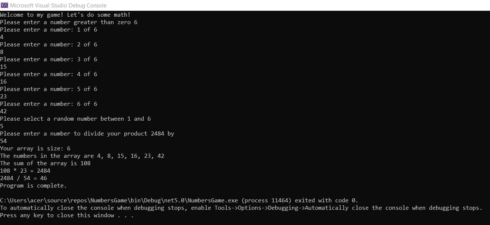

# Lab01-Numbers-Game
---
## To run the program: 

- You must have installed Visual studio and .NET 5.0 version or higher.
- Create a project and name it NumbersGame.
- Then you have to replace your Program.cs file with the one in repo.
- Run the project by pressing F5 or the play button.
---
## Questions to Consider:

1. What is the purpose of the program? this program is created to practice different types of exceptions and how to handel them.
2. How do I run the program? Just press F5 or the play button.
3. What does the program look like? basically it is a console app, so a console window will pop up and prompt you to enter a couple of numbers, then it will show you the output of the methods.
---
## Image after the program runs

---
